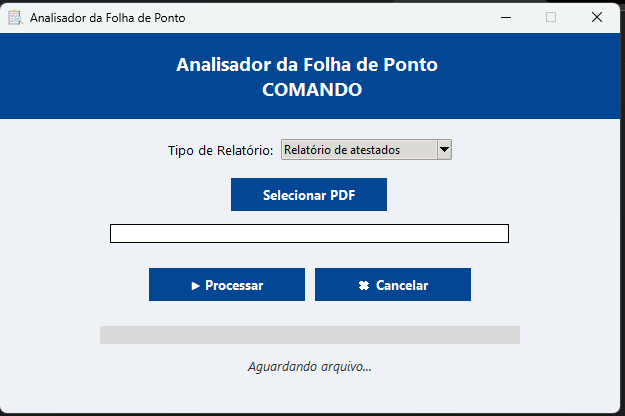

# 🧾 Analisador da Folha de Ponto





Interface gráfica em **Python (Tkinter)** para automatizar a extração e análise de folhas de ponto em PDF, permitindo gerar relatórios detalhados de **atestados** ou **horários** de funcionários.


---


## 📌 Visão Geral


O **Analisador da Folha de Ponto** é uma ferramenta desenvolvida para facilitar a leitura e interpretação de folhas de ponto emitidas em formato PDF.  

O sistema extrai automaticamente as informações, gera um arquivo Excel organizado e realiza análises específicas conforme o tipo de relatório escolhido.


A interface é simples, moderna e intuitiva — basta selecionar o PDF e escolher o tipo de relatório desejado.


---


## ⚙️ Funcionalidades Principais


- 📂 **Leitura automática de PDFs** de folha de ponto.  

- 📊 **Geração de relatórios personalizados** em Excel:

&nbsp; - **Relatório de horários:** analisa entradas, saídas e períodos de trabalho.

&nbsp; - **Relatório de atestados:** identifica e registra atestados médicos.  

- 🎨 **Interface gráfica amigável (Tkinter)**, sem necessidade de comandos no terminal.  

- 📁 **Arquivos de saída organizados** com sufixos descritivos:  

&nbsp; - `_horarios.xlsx` → Relatório de horários  

&nbsp; - `_atestados.xlsx` → Relatório de atestados  

&nbsp; - `_processado.xlsx` → Caso o tipo de relatório não seja reconhecido  

- 🧠 **Processamento seguro e não bloqueante**, com barra de progresso e opção de cancelamento.  

- 🖋️ **Formatação automática no Excel** (cabeçalhos, cores, alinhamento e colunas ajustadas).  


---


## 🖥️ Como Usar


1. Execute o aplicativo:

```
python main.py

```

2. Na janela que abrir:

* Clique em **“Selecionar PDF”** e escolha o arquivo da folha de ponto.
* Escolha o tipo de relatório desejado:

&nbsp;- **Relatório de horários**

&nbsp;- **Relatório de atestados**
     
* Clique em **“Processar”**.
3. Aguarde o processamento (a barra de progresso mostrará o andamento).
4. O arquivo Excel será salvo automaticamente na mesma pasta do PDF selecionado.

---

## 📂 Estrutura do Projeto

```

📁 AnalisadorFolhaPonto/

├── main.py                 # Interface principal (Tkinter)

├── extrair\_tabela.py       # Responsável por extrair dados do PDF e gerar Excel

├── analisar\_folha.py       # Gera o relatório de horários

├── analisar\_atestados.py   # Gera o relatório de atestados

├── icone.ico               # Ícone da aplicação

└── README.md               # Documentação do projeto

```

---

## 🧠 Lógica de Funcionamento

1. O **usuário seleciona o PDF** e o **tipo de relatório**.
2. O aplicativo chama a função `gerar_excel()` (em `extrair_tabela.py`) para extrair e converter o conteúdo do PDF em Excel.
3. Dependendo do tipo de relatório selecionado:

    * Chama `analisar_folha()` → gera arquivo `_horarios.xlsx`
    * Chama `analisar_atestados()` → gera arquivo `_atestados.xlsx`
4. Caso o tipo de relatório não seja reconhecido, o programa gera um arquivo `_processado.xlsx`.

---

## 🧾 Relatórios Gerados

### 🕐 Relatório de Horários

Analisa os dados de ponto (entrada, almoço, saída) e calcula totais e diferenças de horários por funcionário.

### 🩺 Relatório de Atestados

* Cria uma aba chamada **ATESTADOS** no início da planilha.
* Lista o **nome do funcionário**, **data** e **detalhe** (texto completo da ocorrência).
* As linhas correspondentes a atestados são **pintadas de verde** nas abas individuais dos funcionários.
* O cabeçalho é formatado com **negrito, centralização e borda inferior**.
* As colunas têm **largura ajustada automaticamente**, e **as linhas de grade são ocultadas**.

---

## 🧩 Tecnologias Utilizadas

* **Python 3**
* **Tkinter** → Interface gráfica
* **openpyxl** → Manipulação e formatação de planilhas Excel
* **pdfplumber** → Leitura e extração de dados de PDFs
* **threading** → Processamento paralelo (mantém a interface fluida)

---

## 🧠 Boas Práticas

* Use **arquivos PDF legíveis (não escaneados)** para garantir extração correta.
* Mantenha o nome das colunas originais (“Data” e “Ocorrencia”) no Excel extraído.
* Não modifique manualmente o arquivo Excel gerado antes de finalizar a análise.

---

## 👩‍💻 Créditos

**Desenvolvido por Ana Quidute**

Projeto: **“Analisador da Folha de Ponto”**

---